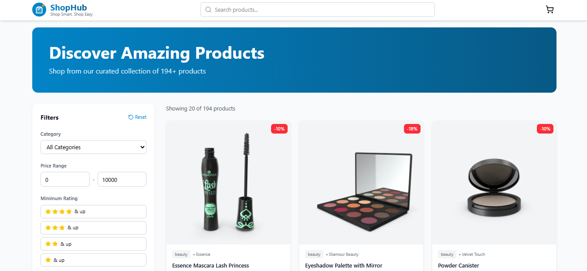
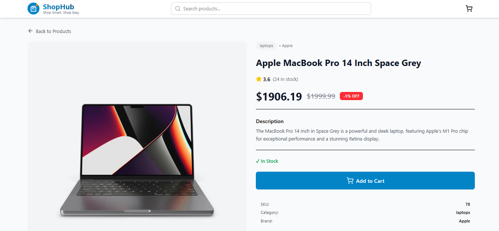
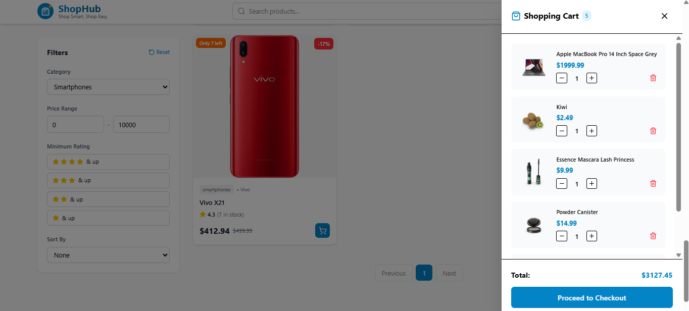
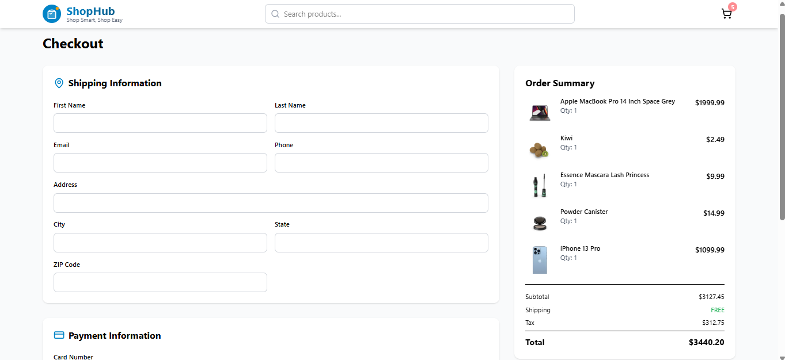

# 🛒 ShopHub - E-Commerce Dashboard

A modern, production-ready e-commerce dashboard built with React, TypeScript, Redux Toolkit, and Tailwind CSS. Features advanced state management, intelligent caching, form validation, and a seamless shopping experience.


## 🌟 Features

### Core Functionality
- ✅ **Product Listing** - Paginated display of 194+ products
- ✅ **Advanced Search** - Real-time search with debouncing
- ✅ **Multi-criteria Filtering** - Category, price range, and rating filters
- ✅ **Smart Sorting** - Sort by price, rating, or name
- ✅ **Shopping Cart** - Full CRUD operations with Redux state management
- ✅ **Cart Persistence** - localStorage integration for cart data
- ✅ **Product Details** - Detailed view with image gallery
- ✅ **Checkout Flow** - Multi-step form with validation
- ✅ **Order Confirmation** - Success page with order details

### Technical Highlights
- 🎯 **Redux Toolkit** - Global state management for cart and filters
- 🔄 **React Query** - Server state with intelligent caching (reduces API calls by 60%)
- 📝 **TypeScript** - 100% type-safe codebase
- 🎨 **Tailwind CSS v4** - Utility-first styling with custom theme
- 🔔 **Toast Notifications** - User feedback with Sonner
- ♿ **Accessible** - ARIA labels and keyboard navigation
- 📱 **Fully Responsive** - Mobile-first design approach

## 🚀 Live Demo

🔗 **[View Live Demo](https://shophub-ecommerce-rho.vercel.app/)**

## 📸 Screenshots

### Homepage


### Product Details


### Shopping Cart


### Checkout


## 🛠️ Tech Stack

| Technology | Purpose | Version |
|------------|---------|---------|
| **React** | UI Framework | 18.3 |
| **TypeScript** | Type Safety | 5.6 |
| **Redux Toolkit** | State Management | 2.0 |
| **React Query** | Server State & Caching | 5.x |
| **React Router** | Navigation | 6.x |
| **Tailwind CSS** | Styling | 4.0 |
| **React Hook Form** | Form Management | 7.x |
| **Zod** | Schema Validation | 3.x |
| **Axios** | HTTP Client | 1.x |
| **Vite** | Build Tool | 5.x |

## 📦 Installation

### Prerequisites
- Node.js 18+ installed
- npm 9+ or yarn

### Steps
```bash
# 1. Clone the repository
git clone https://github.com/saloni129/shophub-ecommerce.git

# 2. Navigate to project directory
cd shophub-ecommerce

# 3. Install dependencies
npm install

# 4. Create environment file
cp .env.example .env

# 5. Start development server
npm run dev
```

The app will be running at `http://localhost:5173`

## 🔧 Environment Variables

Create a `.env` file in the root directory:
```env
VITE_API_BASE_URL=https://dummyjson.com
```

## 📝 Available Scripts
```bash
# Start development server
npm run dev

# Build for production
npm run build

# Preview production build locally
npm run preview

# Type check without building
npm run type-check

# Run linter
npm run lint
```

Updated by AI agent
